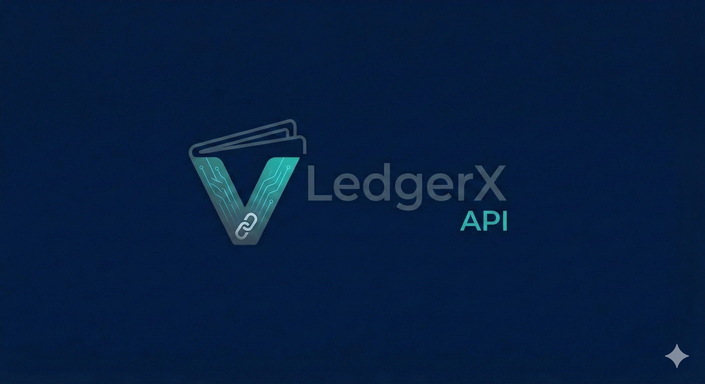
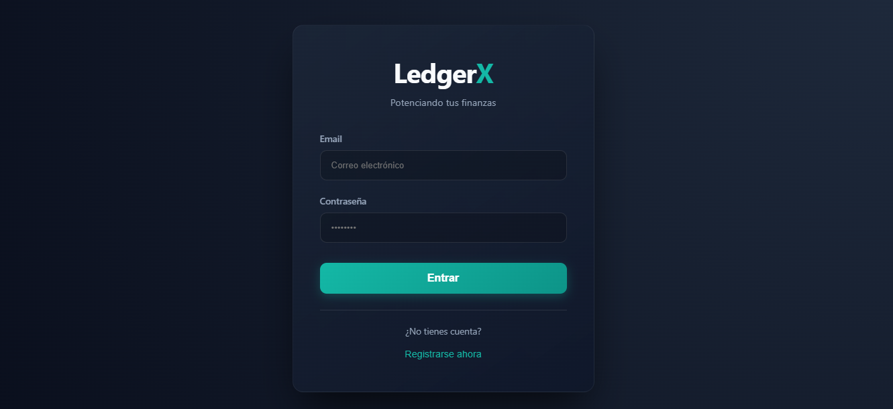
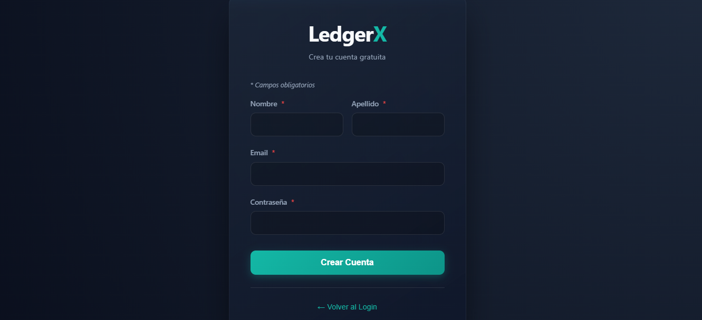
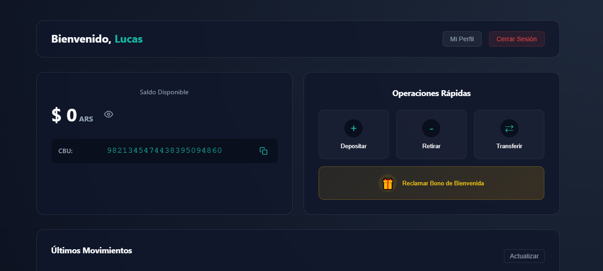
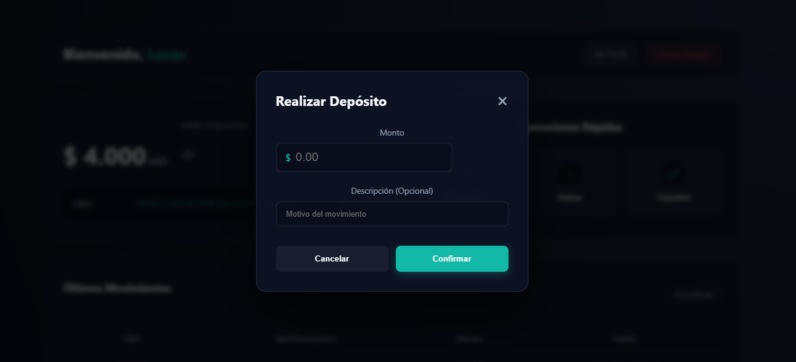
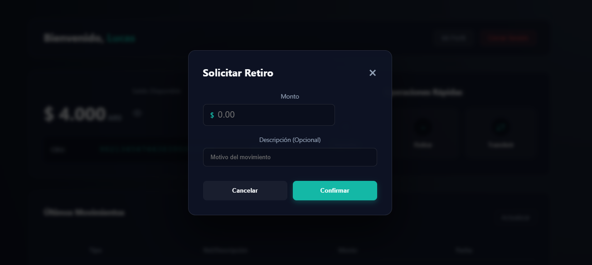
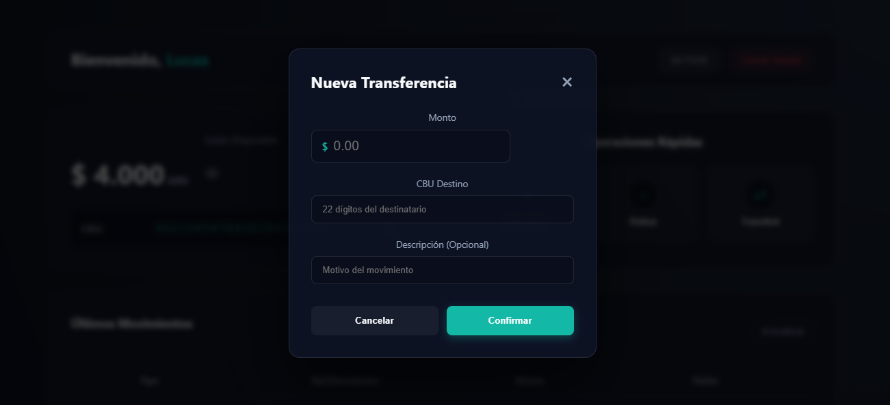
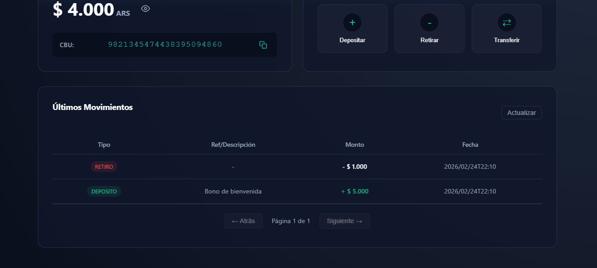
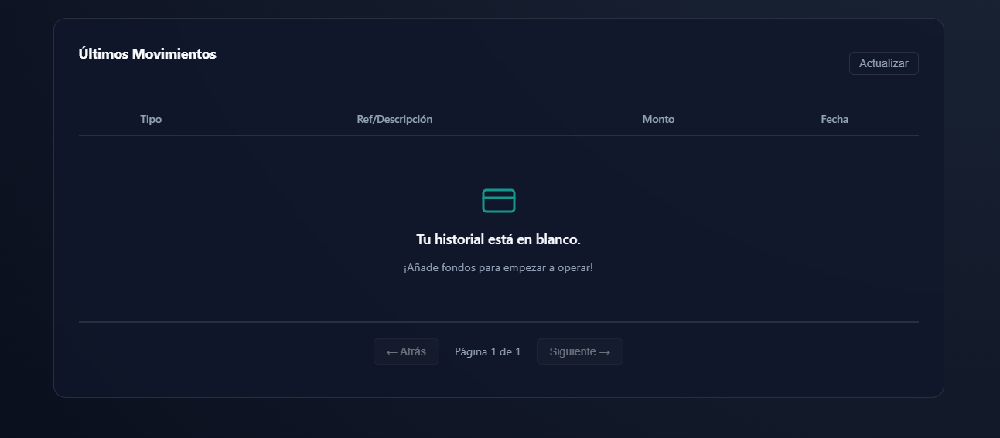
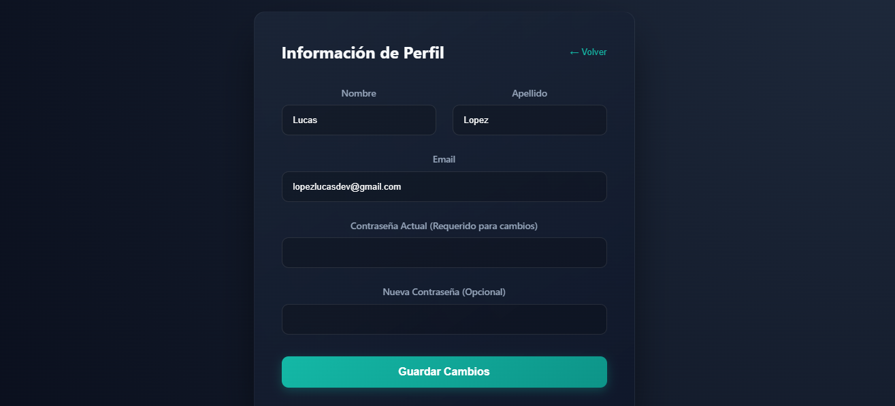

# 🏦 LedgerX - Sistema de Billetera Virtual

LedgerX es una aplicación web full-stack de gestión financiera (billetera virtual) diseñada para manejar cuentas de usuarios, saldos y un registro inmutable de transacciones, con un diseño moderno e interfaces dinámicas.

## 🎯 ¿Qué problemática principal resuelve?
En el universo de las finanzas y las transacciones online, muchas herramientas resultan monolíticas o lentas al manejar múltiples registros, y frecuentemente carecen de un modelo confiable para auditorías inmutables en tiempo real.
**LedgerX resuelve este problema** simulando la arquitectura híbrida que emplean las grandes *Fintechs*: proporciona una cuenta virtual rápida con CBU automático y validación inmediata, donde la agilidad y las reglas transaccionales se gestionan relacionalmente (PostgreSQL), pero todo historial y evento de operación se asienta de manera asíncrona e inmutable en un modelo de documentos (MongoDB). Esto garantiza tanto la velocidad de la cuenta personal, como la resiliencia en la trazabilidad del dinero (operaciones trazables, prevención de transacciones duplicadas, etc).

## 💡 ¿Por qué se hizo este proyecto?
Este proyecto nació de la motivación de aplicar principios de desarrollo de software avanzado (Clean Architecture, Principios SOLID) en una arquitectura distribuida y políglota. 

Fue creado para integrar bases de datos políglotas (usar la base de datos correcta para el trabajo específico) garantizando robustez mediante idempotencia financiera, sumado al desarrollo de una Interfaz Gráfica de Usuario (GUI) fluida, moderna y 100% responsiva. Es una demostración completa de habilidades de desarrollo web Full Stack orientadas a la exigencia de la industria actual.

## 📸 Capturas de Pantalla

Aquí tienes un vistazo de las principales interfaces de la aplicación:

### Autenticación

### Panel de Control (Dashboard)

### Operaciones Financieras

### Historial de Transacciones

### Datos de Usuario

---

## 🚀 Estructura del Proyecto

El repositorio maneja sus entornos completamente desacoplados. Está dividido en dos partes principales:

- **[Backend](./backend/)**: API RESTful desarrollada con Java 17, Spring Boot, Spring Security + JWT, persistencia políglota (PostgreSQL + MongoDB Atlas).
- **[Frontend](./frontend/)**: Interfaz de usuario Single Page Application (SPA), construida con React, Vite y CSS plano responsivo para dispositivos móviles.

## 🔗 Enlaces Desplegados (Live Demo)

- **Frontend (App Web interactiva)**: [https://spring-boot-ledger-x.vercel.app/](https://spring-boot-ledger-x.vercel.app/)

> [!WARNING]  
> **Aviso de rendimiento inicial:** Dado que el backend está alojado en un servicio en la nube de capa gratuita (Render), el servidor entra en estado de suspensión tras 15 minutos de inactividad. **El primer inicio de sesión del día puede demorar entre 30 a 60 segundos** mientras la máquina virtual de Java se "despierta". Las interacciones posteriores serán instantáneas.

## ☁️ Arquitectura de Despliegue (Cloud)
Este proyecto fue diseñado para estar 100% alojado en la nube aprovechando las capas gratuitas (Free Tiers) de múltiples plataformas (BaaS y PaaS), logrando un hosting robusto con costo $0:

1. **Frontend**: Desplegado en **Vercel**, conectado vía integración directa a GitHub para Integración y Despliegue Continuo (CI/CD).
2. **Backend**: Desplegado como un Java Web Service en **Render.com**.
3. **Bases de Datos**:
   - **PostgreSQL**: Alojada en **Neon.tech** (Serverless Postgres), elegida por su compatibilidad nativa de conexión IPv4 gratuita para comunicarse sin problemas con Render.
   - **MongoDB**: Alojada en un cluster dedicado en **MongoDB Atlas** gestionando logs y eventos.

## 👩‍💻 Autor
Proyecto desarrollado e ideado por **[Lucas Lopez](https://github.com/LucasLopez13)** © 2026.
*Aplicación de código abierto orientada a exhibición de portafolio y uso educativo.*
