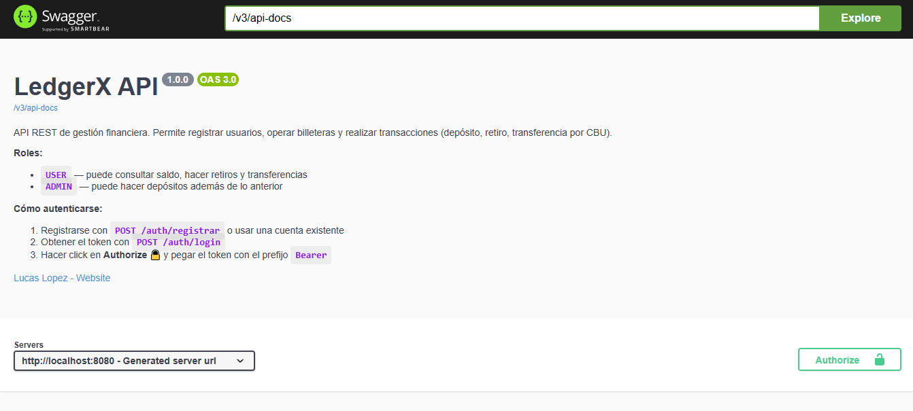
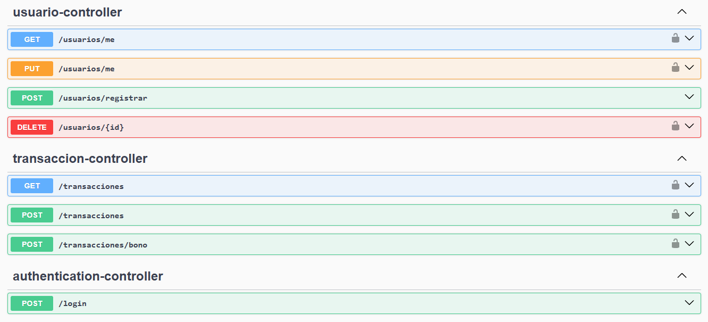

# ⚙️ LedgerX - Backend API

El corazón e ingeniería transaccional de LedgerX está construido bajo una API RESTful de grado empresarial impulsada por Spring Boot.

## 🛠️ Stack Tecnológico
- **Java 17**
- **Spring Boot 3.3.x**
- **Spring Security & JSON Web Tokens (JWT)**: Autenticación delegada, filtros personalizables de solicitudes.
- **Spring Data JPA, Hibernate, JDBC**
- **Ecosistema Políglota de Bases de Datos:**
  - **PostgreSQL**: Datos estructurados y validaciones complejas ACID (Usuarios, Cuentas/Billeteras).
  - **MongoDB Atlas**: Datos no relacionales masivos usados puramente como Registro Ledger inmutable de auditoría (Historial Completo de transacciones).
- **Flyway Database Migrations**: Manejo predictivo y versionado de las tablas del motor SQL.
- **Maven**: Motor de dependencias del proyecto.

## 🏗️ Patrones de Arquitectura Resaltables
La estructura divide componentes siguiendo una Clean / Onion Architecture:
1. **Modelado de Dominio:** Entidades limpias separadas de librerías externas.
2. **Infraestructura:** Repositorios e implementaciones nativas.
3. **Casos de Uso Transaccionales (Bussiness Logic):** Transacciones seguras bajo anotación `@Transactional`.

### Conceptos Clave Implementados:
- **Idempotencia Transaccional:** Se implementaron Tokens de Idempotencia únicos en cada solicitud (especialmente en depósitos, retiros y transferencias). Esto previene ataques de repetición o problemas de red donde un usuario podría enviar accidentalmente el click de pago dos veces, garantizando que el impacto en base de datos ocurra una única vez.
- **Control de Concurrencia (Locks):** Para prevenir "condiciones de carrera" (Race Conditions) donde múltiples peticiones simultáneas intentan restar o sumar saldo a la misma billetera al mismo tiempo, se integraron bloqueos a nivel de Base de Datos. Dependiendo el caso de uso se utilizan Bloqueos Optimistas (`@Version` en Hibernate) o Bloqueos Pesimistas a nivel SQL (`PESSIMISTIC_WRITE`) garantizando la integridad monetaria sin corromper el saldo.
- **Trazabilidad Pura:** Todo impacto financiero recae en persistencias separadas y permanentes (PostgreSQL para saldos y MongoDB para historial/log).
- **Gestión Global de Errores (@ControllerAdvice):** Manejo normalizado y capturas custom para devolver a React respuestas legibles JSON en caso de fondos insuficientes, cuentas inexistentes u otros escenarios.
- **Documentación Interactiva (Swagger/OpenAPI 3):** La API está completamente autodocumentada. Una vez levantado el servidor localmente, se puede interactuar visualmente con todos los endpoints expuestos ingresando a `http://localhost:8080/swagger-ui/index.html`.

### 📖 Swagger API & Seguridad
La interfaz web de Swagger fue parametrizada para integrar **Spring Security**. 
Muchos endpoints (como `/transacciones` o `/usuarios/saldo`) se encuentran protegidos. Para efectuar pruebas sobre ellos desde la UI es necesario:
1. Crear un usuario (o usar uno existente).
2. Hacer una petición `POST` al endpoint de `/login` para obtener el **Token JWT**.
3. Presionar el botón `Authorize` 🔓 en Swagger y pegar el Bearer Token, habilitando así todas las funciones de la billetera.



## 🚀 Compilación y Ejecución en el Servidor Local

### Prerrequisitos
- **Java JDK 17** instalado en variables de Entorno.
- **PostgreSQL** corriendo (usualmente en puerto local 5432).
- **MongoDB** corriendo o clúster de Atlas aprovisionado.

### Parámetros Exigidos
Crea las siguientes variables de sistema para no quemar contraseñas en código:
- `DB_HOST`, `DB_NAME`, `DB_USER`, `DB_PASSWORD` (Credenciales para su Base PostgreSQL).
- `MONGO_URI` (El URI String standard de acceso a Mongo Atlas).
- `JWT_SECRET` (Código alfanumérico largo para generar certificados Token cifrados).
- `CORS_ALLOWED_ORIGIN` (Por defecto `http://localhost:5173` para aceptar tu React corriendo de forma local).

### Ejecutar App en Bash
```bash
./mvnw clean install
./mvnw spring-boot:run
```

### 🐳 Ejecutar con Docker
Si dispones de Docker y Docker Compose, puedes levantar el ecosistema completo (Backend + Base de Datos local) o simplemente crear la imagen del backend con el siguiente código provisto en el archivo `Dockerfile`.

Para construir la imagen:
```bash
docker build -t ledgerx-backend .
```
Para ejecutar un contenedor a partir de ella (recuerda pasarle tus variables de entorno, o hacer uso de un `.env` dockerizado):
```bash
docker run -p 8080:8080 --env-file .env ledgerx-backend
```

## 🧪 Testing y Validación Analítica
El proyecto cuenta con un excelente ecosistema de Testing: Pruebas unitarias completas generadas vía Mockito para lógicas matemáticas y de servicio, sumado a pruebas de integridad de control usando H2 Database + @SpringBootTest.
**Para ejecutar:**
```bash
./mvnw test
```
